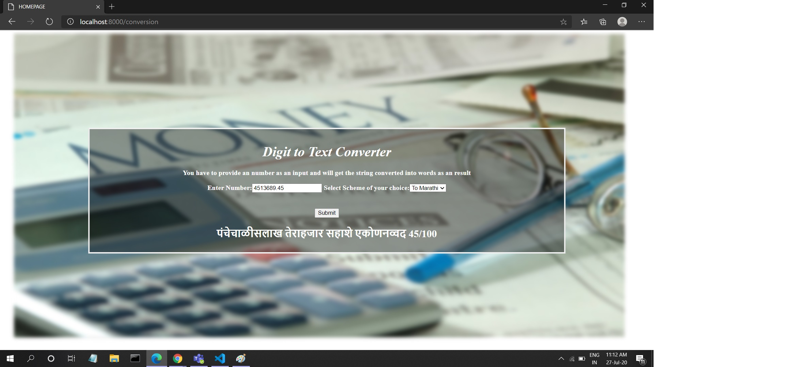

## ThinkBridge_intern

This is a python program which returns the output in words for the input currency value

# Prerequisite 
1. **Python3**
Make sure you have Python3 installed on your machine.
The Python download requires about 25 Mb of disk space; keep it on your machine, in case you need to re-install Python. When installed, Python requires about an additional 90 Mb of disk space.
Download and Install from:

      https://www.python.org/downloads/      

2. **VS Code**
Visual Studio Code is a free source-code editor made by Microsoft for Windows, Linux and macOS. Features include support for debugging, syntax highlighting, intelligent code completion, snippets, code refactoring.
Download nd Install it from:

      https://code.visualstudio.com/download

3. **Django Framework**
Django is a Python-based free and open-source web framework that follows the model-template-view architectural pattern.
Install django using following command:
  
          $ python -m pip install Django
  
4. **Browser support**
   Chrome , Internet Explorer

  
 Compile the given codes
 1. urls.py
 2. views.py
 3. forms.py
 4. styles.css
 5. mainpage.html
 
Run the server using below cmd from parent converterproject directory : It runs the manage.py file
   
      $python manage.py runserver

Open the browser and go to url : 
 - http://localhost:8000/    opening the local host on local machine. This will show the 'mainpage' web page as shown below
 
 Give any no as input and select the scheme to convert the input in English/Hindi/Marathi text language .
 
 the results will be seen like this:

   
